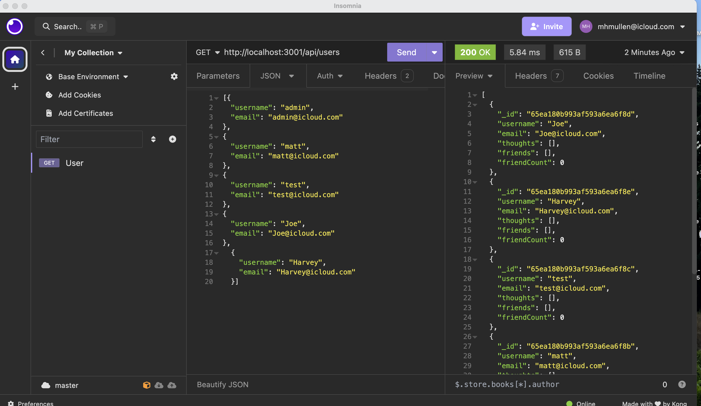

# My-Social-API
A social network web application where users can share their thoughts, react to friends’ thoughts, and create a friend list.

## Visuals

https://github.com/MMullen4/My-Social-API

## Installation
User must install npm i inquirer, mongoose, and insomnia to view results.

## Usage
User is presented with the following options via insomnia :
 - GET routes for all users and all thoughts 
 - GET routes for a single user & single though
 - POST, PUT, and DELETE routes for users and thoughts
 - POST and PUT routes for a user's friend list
 - POST, PUT and DELETE routes for reactions to thoughts

## Support
Please reach out to me with any questions - matt@mmcprintpackaging.com

## Contributing
Open to suggestions.

## Authors & Acknowledgement
Myself and UCLA tutors, TAs and Bootcamp lessons

## License
N/A

## Project Status
Ongoing and will be updated with new/relavent info as needed.
